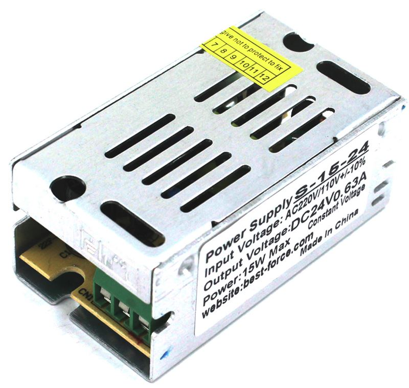
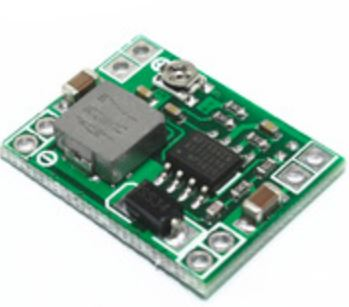

## Bill of Materials

Symbol | Component | Package | Mouser Part No
---- | ------------ | ------------ | ------------
U1 | MAX31855K | SOIC8 | 700-MAX31855KASA+
Q2 | SI2308 or similar | SOT23 | 781-SI2308BDS-E3
R1 |  10K | SMD 0603 | 603-RC0603FR-0710KL
R2 |  10K | SMD 0603 | 603-RC0603FR-0710KL
R3 |  10K | SMD 0603 | 603-RC0603FR-0710KL
R4 |  680 | SMD 0603 | 603-RC0603FR-10680RL
R5 |  100 | SMD 0603 | 603-RC0603FR-07100RL
C1 | 10n-40n | SMD 0603 | 710-885012206016
C2 | 10n-40n | SMD 0603 | 710-885012206016
C3 | 10n-40n | SMD 0603 | 710-885012206016
C4 | 10uf | SMD 0603 | 963-JMK107BJ106MA-T
C5 | 10n | SMD 0603 | 710-885012206014
C6 | 100n | SMD 0603 | 81-GCM188R71E104KA7D
D1 | 1N4148W | SMD SOD-523 | 512-1N4148WT
D2 | 1N4148W | SMD SOD-523 | 512-1N4148WT
SW1 | Rotary Encoder EC11 | | Ebay, Aliexpress or Banggood 
Display | OLED 128x32 with I2c | | Ebay, Aliexpress or Banggood 
SSD | CPC1998 | i4-PAC | 849-CPC1998J

Please note, SSD relay is not mounted on PCB. It should be connected with wires to the Heat- Heat+ pins (behind rotary encoder).

You also need to have 24v power supply for ventilator. Something like this: https://www.aliexpress.com/item/Mini-Size-DC-24V-Power-Supply-Switching-Lighting-Driver-Transformer-100-240V-AC-to-DC24V-SMPS/32818299879.html

And for powering Arduino you will need DC/DC converter. Something like this:
https://www.aliexpress.com/item/Free-Shipping-1PCS-XM1584-Ultra-small-size-DC-DC-step-down-power-supply-module-3A-adjustable/32251969850.html

