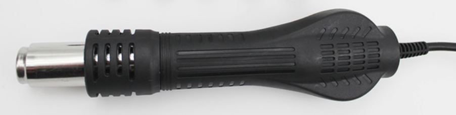
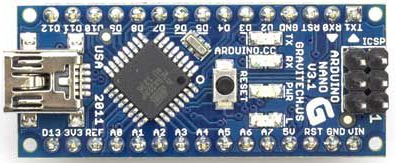
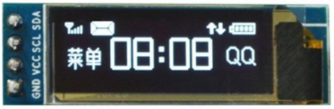
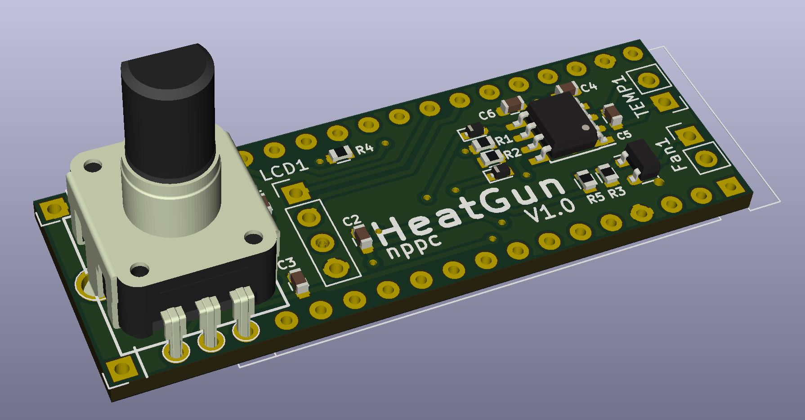
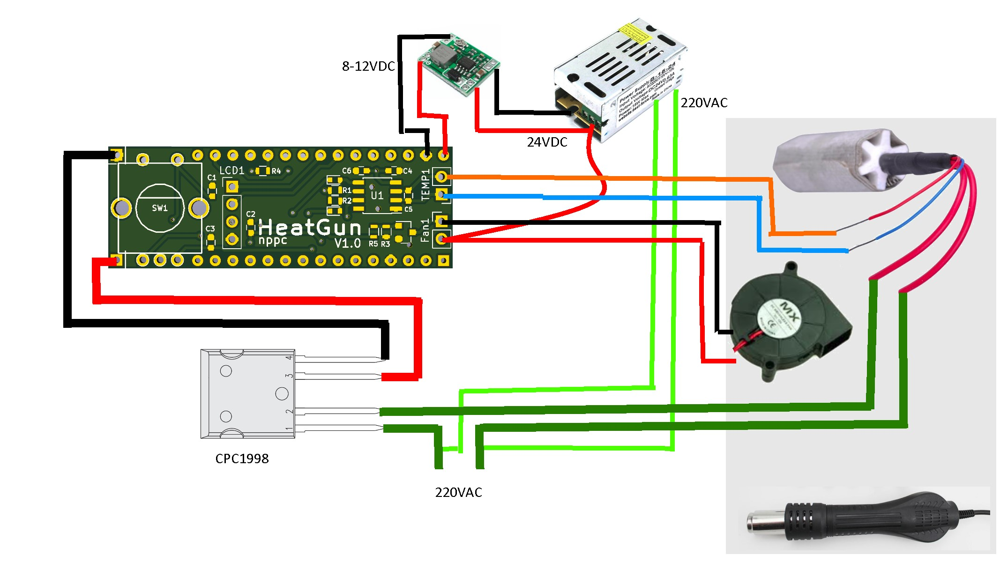

# HotAirGunController
## Controller for Hot Air Gun with 220v heater and 24v fan
You can use Hot Air Desoldering Gun Handle FOR 858 858D 898D 852D Soldering Station Hot-air Rework Station

Arduino Nano

i2c OLED 0.91'' (128x32 pixels)

and any 240AC Solid State Switch like CPC1998

PCB from oshpark: https://oshpark.com/shared_projects/ofOX8gMQ

## Workable PIDs
P: 60

I: 3

D: 100

## Alternative PIDs
If your PID control goes crazy, then try these PIDs:

P: 40

I: 3

D: 30

